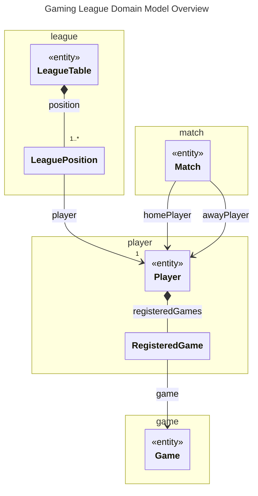

```mermaid
---
  title: Gaming League Domain Model Overview
  config:
    class:
      hideEmptyMembersBox: true
---
classDiagram
    namespace  game {
        class Game {
            <<entity>>
        }
    }

    namespace player {
        class Player {
            <<entity>>
        }
        class RegisteredGame {
        }
    }

    namespace match {
        class Match {
            <<entity>>
        }
    }
        
    namespace league {
        class LeagueTable {
            <<entity>>
        }

        class LeaguePosition {
        }
    }
    LeagueTable *-- "1..*" LeaguePosition : position
    LeaguePosition --> "1" Player : player
    Match --> Player : homePlayer
    Match --> Player : awayPlayer
    Player *-- RegisteredGame : registeredGames
    RegisteredGame --> Game : game
```