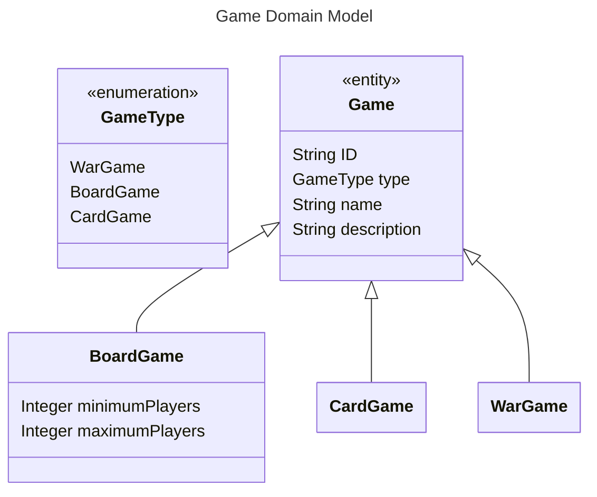

```mermaid
---
  title: Game Domain Model
  config:
    class:
      hideEmptyMembersBox: true
---
%%    namespace "game"
classDiagram
    class GameType {
        <<enumeration>>
        WarGame
        BoardGame
        CardGame
    }
    class Game {
        <<entity>>
        String ID 
        GameType type
        String name
        String description
    }
    class BoardGame {
        Integer minimumPlayers
        Integer maximumPlayers
    }

    Game <|-- BoardGame 
    Game <|-- CardGame 
    Game <|-- WarGame 
```