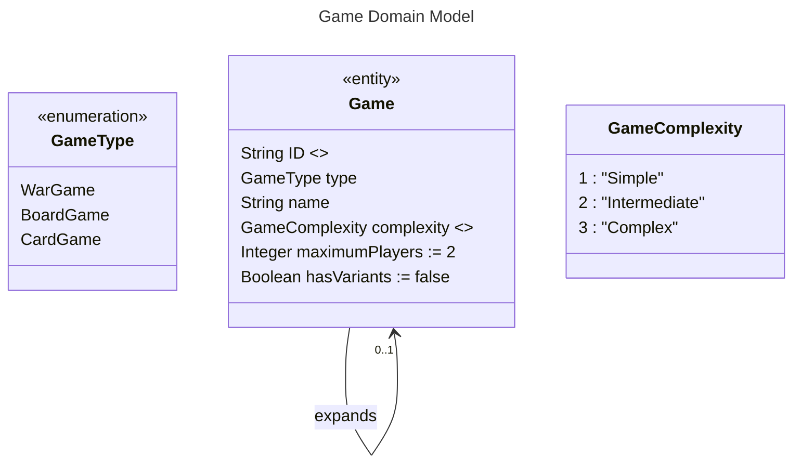

#   Game Domain Model

```mermaid
---
  title: Game Domain Model
  config:
    class:
      hideEmptyMembersBox: true
---
%%    namespace "game"
classDiagram
    class GameType {
        <<enumeration>>
        WarGame
        BoardGame
        CardGame
    }
    class Game {
        <<entity>>
        String ID <<key>>
        GameType type
        String name
        GameComplexity complexity <<optional>>
        Integer maximumPlayers := 2
        Boolean hasVariants := false
    }
    Game --> "0..1" Game : expands 

    class GameComplexity {
        1 : "Simple"
        2 : "Intermediate"
        3 : "Complex"
    } 
```