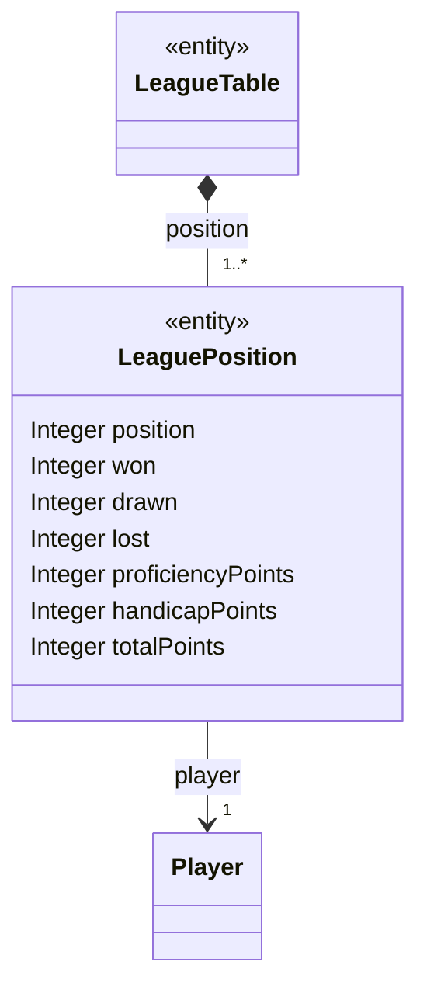

```mermaid
classDiagram
    class LeagueTable {
        <<entity>>
    }

    class LeaguePosition {
        <<entity>>
        Integer position
        Integer won
        Integer drawn
        Integer lost
        Integer proficiencyPoints
        Integer handicapPoints
        Integer totalPoints
    }
    LeagueTable *-- "1..*" LeaguePosition : position
    LeaguePosition --> "1" Player : player
```