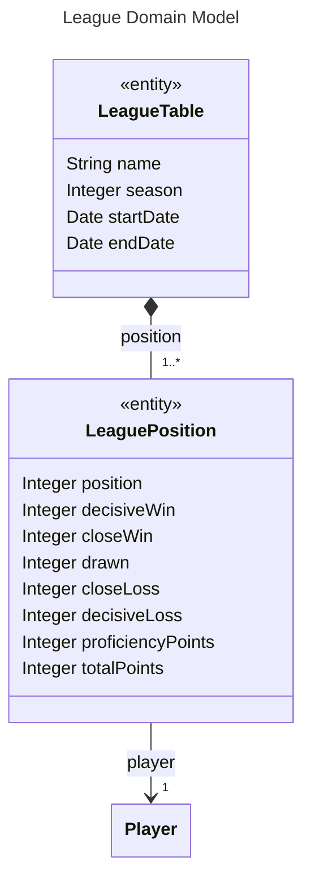

#   League Table Domain Model

```mermaid
---
  title: League Domain Model
  config:
    class:
      hideEmptyMembersBox: true
---
classDiagram
%%    namespace "league"
    class LeagueTable {
        <<entity>>
        String name
        Integer season
        Date startDate
        Date endDate
    }

    class LeaguePosition {
        <<entity>>
        Integer position
        Integer decisiveWin
        Integer closeWin
        Integer drawn
        Integer closeLoss
        Integer decisiveLoss
        Integer proficiencyPoints
        Integer totalPoints
    }
    LeagueTable *-- "1..*" LeaguePosition : position
    LeaguePosition --> "1" Player : player
```