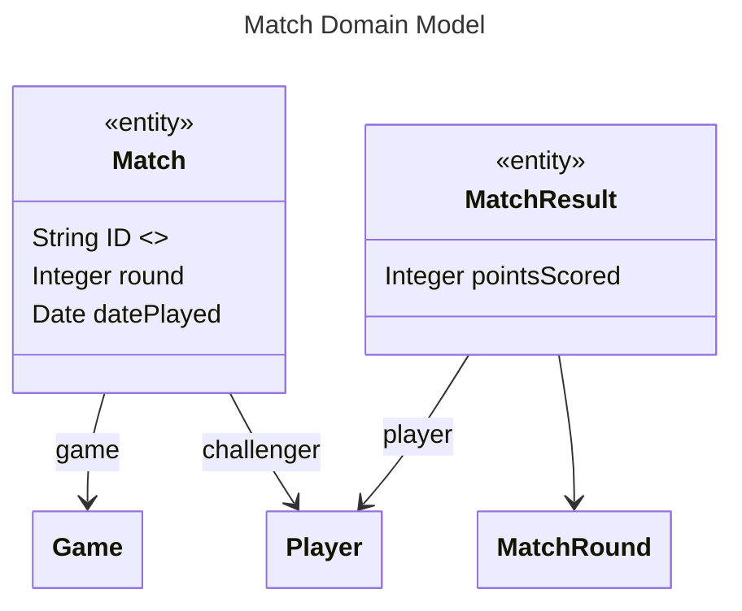

#   Match Domain Model 

```mermaid
---
  title: Match Domain Model
  config:
    class:
      hideEmptyMembersBox: true
---
%%    namespace "match"
%%    import "design/data/game/Game" as Game
%%    import "design/data/player/Player" as Player
classDiagram
    class Match{
        <<entity>>
        String ID <<key>>
        Integer round
        Date datePlayed        
    }
    Match --> Game : game
    Match --> Player : challenger
    
    class MatchResult {
        <<entity>>
        Integer pointsScored
    }
    MatchResult --> Player : player
    MatchResult --> MatchRound
```