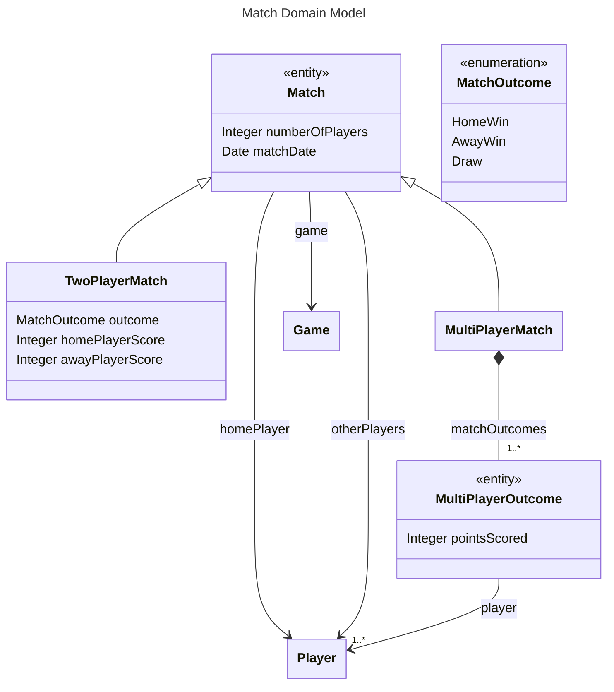

```mermaid
---
  title: Match Domain Model
  config:
    class:
      hideEmptyMembersBox: true
---
classDiagram
%%    namespace "match"
%%    import "design/data/game/Game" as Game
%%    import "design/data/player/Player" as Player
    
    class Match {
        <<entity>>
        Integer numberOfPlayers
        Date matchDate
    }
    class TwoPlayerMatch {
        MatchOutcome  outcome
        Integer homePlayerScore
        Integer awayPlayerScore
    }
    class MultiPlayerMatch {
    }
    class MultiPlayerOutcome {
        <<entity>>
        Integer pointsScored
    }

    Match <|-- TwoPlayerMatch
    Match <|-- MultiPlayerMatch
    Match --> Player : homePlayer
    Match --> "1..*" Player : otherPlayers
    Match --> Game : game
    MultiPlayerMatch *-- "1..*" MultiPlayerOutcome : matchOutcomes
    MultiPlayerOutcome --> Player : player

    class MatchOutcome {
        <<enumeration>>
        HomeWin
        AwayWin
        Draw
    }
```