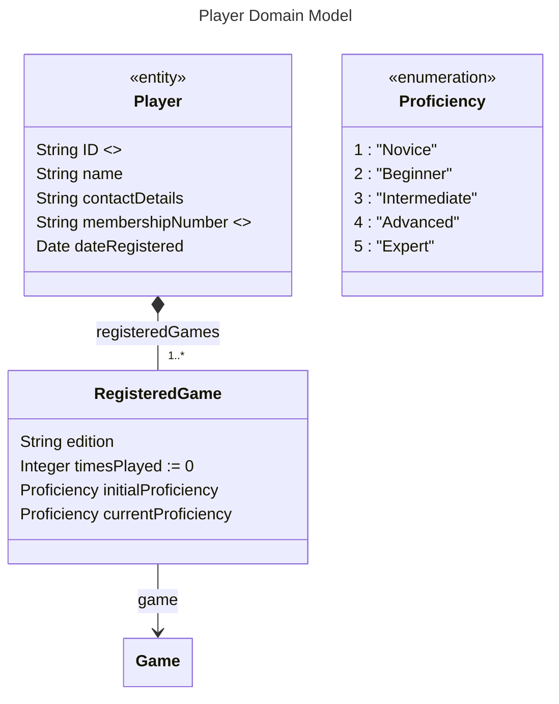

#    Player Domain Model

```mermaid
---
  title: Player Domain Model
  config:
    class:
      hideEmptyMembersBox: true
---
classDiagram
%%    namespace "player"
%%    import "design/data/game/Game" as Game
    class Player {
        <<entity>>
        String ID <<key>>
        String name
        String contactDetails
        String membershipNumber <<optional>>
        Date dateRegistered
    }

    class RegisteredGame {
        String edition
        Integer timesPlayed := 0
        Proficiency initialProficiency
        Proficiency currentProficiency
    }

    Player *-- "1..*" RegisteredGame : registeredGames
    RegisteredGame --> Game : game

    class Proficiency {
        <<enumeration>>
        1 : "Novice"
        2 : "Beginner"
        3 : "Intermediate"
        4 : "Advanced"
        5 : "Expert"
    }
```