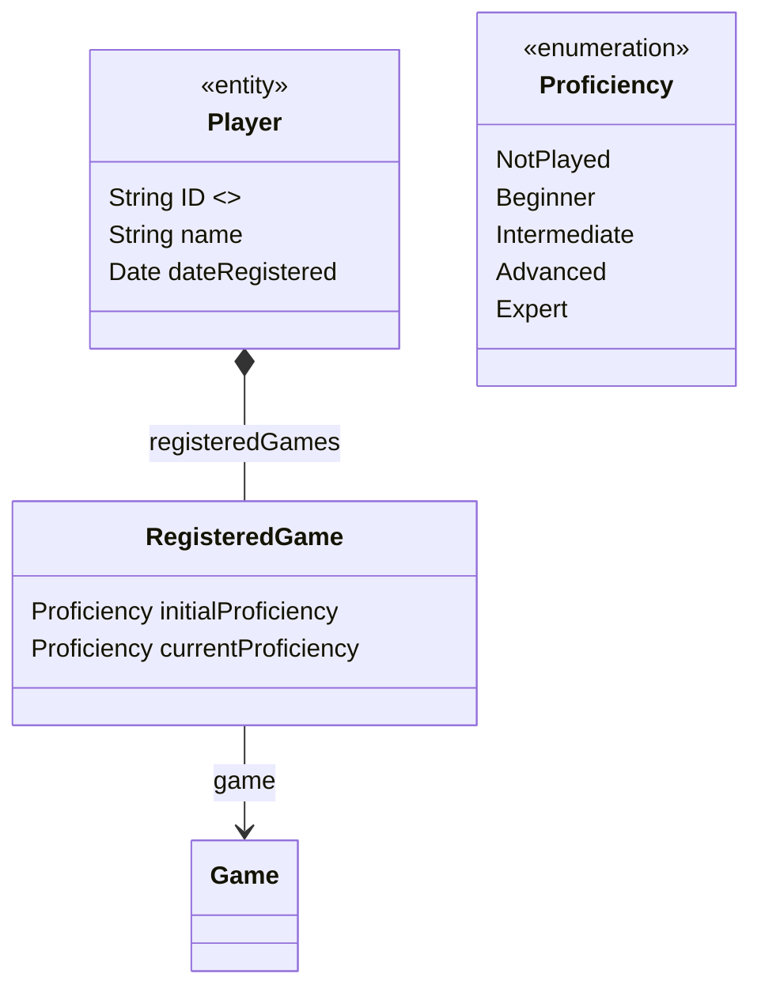

```mermaid
classDiagram
    class Player {
        <<entity>>
        String ID <<key>>
        String name
        Date dateRegistered
    }

    class RegisteredGame {
        Proficiency initialProficiency
        Proficiency currentProficiency
    }

    Player *-- RegisteredGame : registeredGames
    RegisteredGame --> Game : game

    class Proficiency {
        <<enumeration>>
        NotPlayed
        Beginner
        Intermediate
        Advanced
        Expert
    }
```