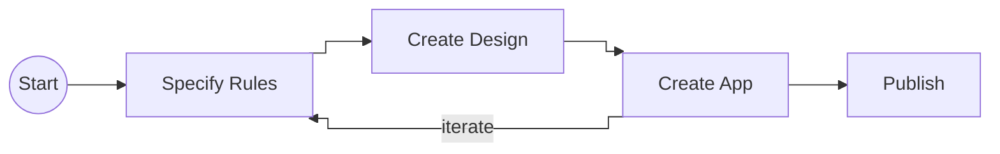

#   Games League Generation

```mermaid
---
config:
    flowchart:
        curve: step
---
flowchart LR
%%    Activities
    Start((Start))
    Specify[Specify Rules]
    Design[Create Design]
    Build[Create App]
    Publish
%%    Flows
    Start --> Specify
    Specify --> Design --> Build --> Publish
    Build -->|iterate| Specify
```

We then iterate around this "_Specify --> Design --> Build_" process each time we need to make changes or add functionality.
